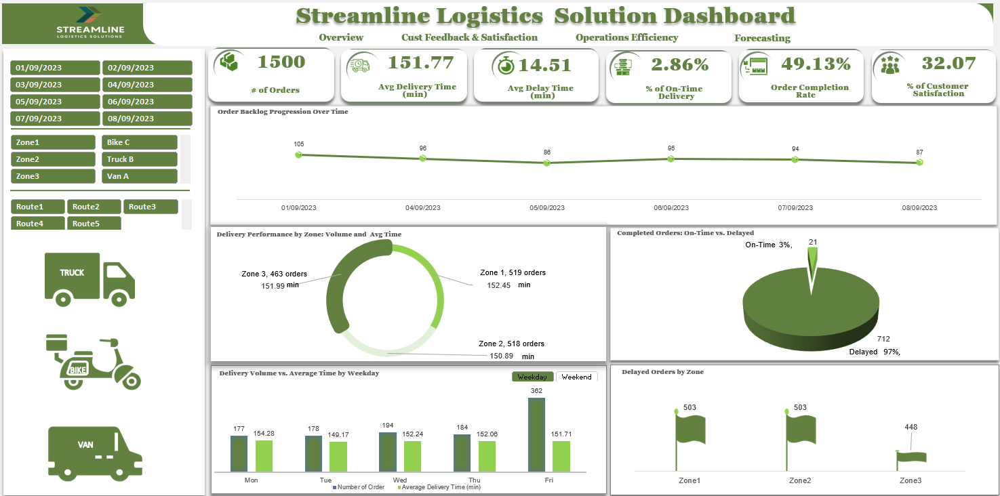
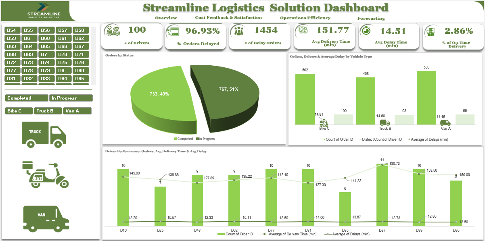
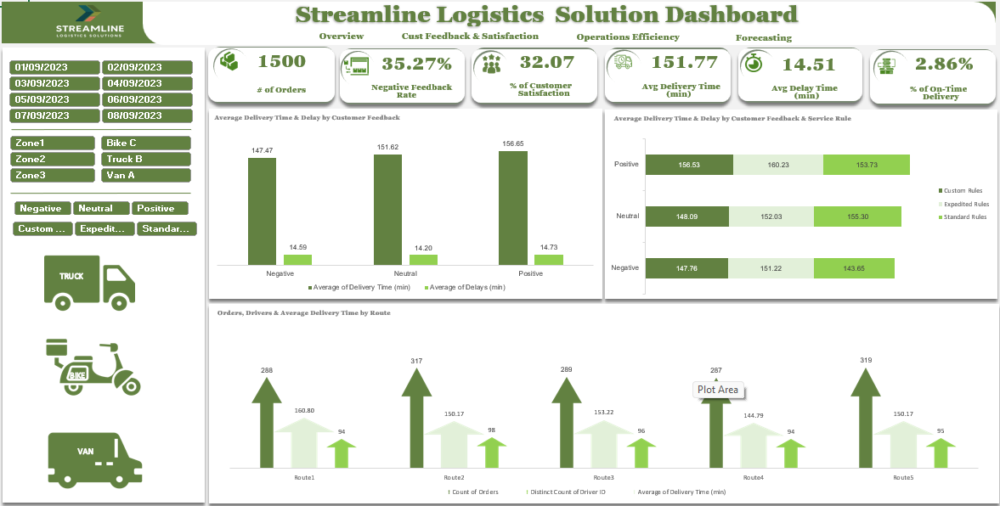
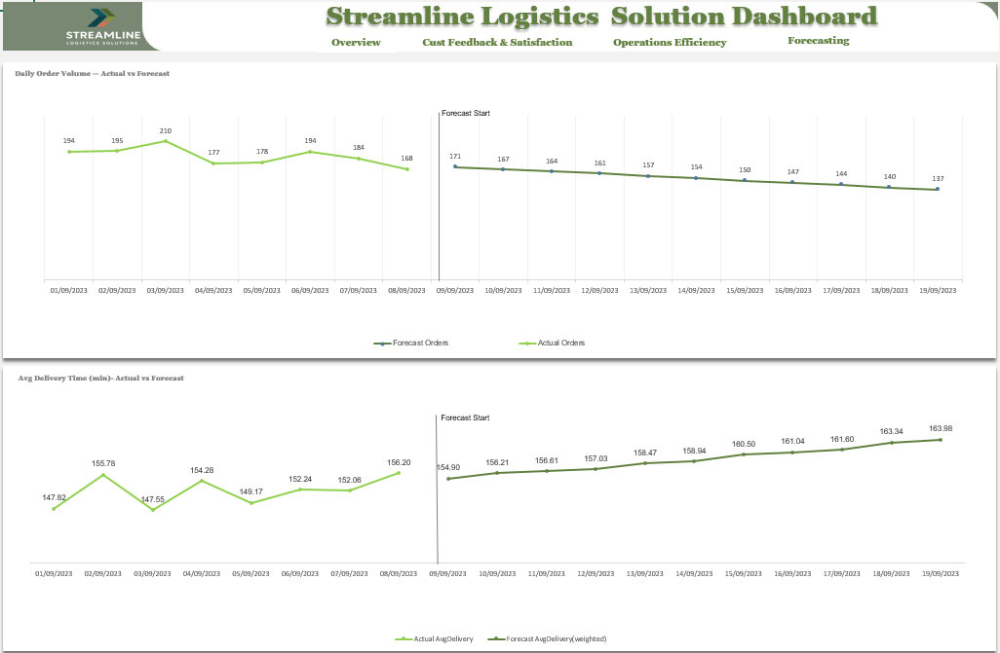

# Streamline Logistics Operations & Order Backlog Analysis Dashboard

Interactive Excel dashboard analysing logistics order backlogs, delivery delays, operational efficiency, and customer satisfaction insights.

---

## Business Challenge

Streamline Logistics Solutions is a growing logistics provider responsible for managing nationwide deliveries across multiple zones and distribution centres. As order volumes increased, the company began experiencing operational challenges such as delayed deliveries, order backlogs, and declining customer satisfaction.

Operational teams lacked a centralised analytical view of delivery performance, driver efficiency, and customer feedback trends, making it difficult to identify bottlenecks and optimise logistics operations.

---

## Project Objective

Develop an interactive Excel dashboard to analyse logistics operations and monitor key performance indicators including:

- Order backlog and completion status
- Delivery delays and operational efficiency
- Driver and zone performance
- Customer feedback and satisfaction
- Demand forecasting and order trends

The dashboard enables data-driven decision-making to improve delivery performance and reduce operational inefficiencies.

---

## Tools & Techniques Used

- Microsoft Excel
- Power Query
- PivotTables
- Data Visualisation
- KPI Analysis
- Data Cleaning & Transformation

---

## Dashboard Preview

### Executive Overview

### Operations Efficiency

### Customer Feedback & Satisfaction

### Forecasting & Demand Trends

---

## Key Insights

- **96.93% of orders experienced delivery delays**, indicating significant operational inefficiencies.
- Only **49% of orders were completed**, while **51% remained in progress**, highlighting backlog risk.
- **35.27% of customer feedback was negative**, suggesting declining customer satisfaction.
- Average delivery time reached **151.77 minutes**, exceeding expected delivery performance targets.
- Some delivery zones consistently underperformed due to inefficient driver allocation and workload imbalance.

---

## Business Impact

The dashboard provides operational visibility into logistics performance and enables data-driven decision-making across delivery operations.

Key business benefits include:

- **Early detection of delivery bottlenecks**, enabling managers to identify zones and drivers contributing to delays.
- **Improved backlog management**, highlighting that only 49% of orders were completed while 51% remained in progress.
- **Customer satisfaction monitoring**, revealing that over 35% of customer feedback was negative, helping prioritise service improvements.
- **Operational performance optimisation**, allowing managers to evaluate delivery efficiency, driver allocation, and workload distribution.
- **Better planning and forecasting**, supporting demand monitoring and operational planning across delivery zones.

These insights help logistics managers optimise delivery processes, reduce delays, improve service quality, and enhance overall operational efficiency.

---

## Project Files

Download the project resources below:

- 📊 Excel Dashboard  
[Download Excel Dashboard](Streamline-Delivery-dashboard.xlsx) 

- 📁 Dataset  
[Download Dataset](logistics_orders_dataset.xlsx)

---

## Project Outcome

This project demonstrates how Excel analytics can be used to transform operational logistics data into actionable insights through dashboards and performance monitoring tools.

The analysis provides a foundation for improving delivery performance, reducing order backlogs, and supporting strategic logistics decision-making.
